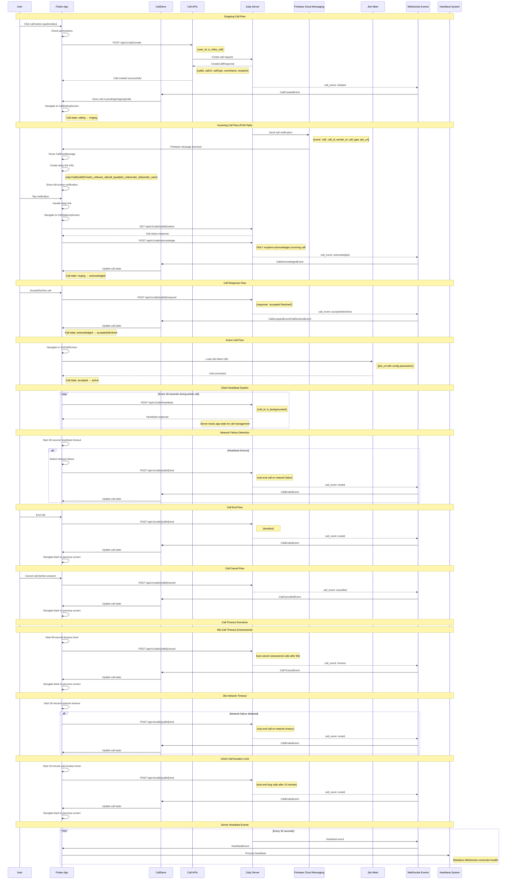

# Zulip Flutter Call Implementation Sequence Diagram

## Complete Call Flow with APIs and Server Heartbeat Events



## Call API Endpoints

### Core Call APIs
- `POST /api/v1/calls/create` - Create new call
- `POST /api/v1/calls/acknowledge` - Acknowledge call (caller/receiver)
- `POST /api/v1/calls/{callId}/respond` - Accept/decline call
- `POST /api/v1/calls/{callId}/cancel` - Cancel call
- `POST /api/v1/calls/{callId}/end` - End active call
- `GET /api/v1/calls/{callId}/status` - Get call status
- `POST /api/v1/calls/heartbeat` - Send heartbeat
- `POST /api/v1/calls/end-all` - End all calls
- `GET /api/v1/calls/active` - Get active calls
- `GET /api/v1/calls/history` - Get call history

### WebSocket Events
- `call_event: initiated` - New call created (caller side)
- `call_event: acknowledged` - Call acknowledged by recipient
- `call_event: accepted` - Call accepted by recipient
- `call_event: declined` - Call declined by recipient
- `call_event: ended` - Call ended normally
- `call_event: cancelled` - Call cancelled by caller
- `call_event: timeout` - Call timed out (unanswered)
- `heartbeat` - Server heartbeat (every 30 seconds)

### FCM Message Types
- `CallFcmMessage` - Incoming call notification
- `MessageFcmMessage` - Regular message notification
- `RemoveFcmMessage` - Remove notification

## Call States and Transitions

### Call Status Enum
- `created` - Call created, waiting for acknowledgment
- `ringing` - Call is ringing (acknowledged by recipient)
- `accepted` - Call accepted by receiver
- `declined` - Call declined by receiver
- `ended` - Call ended normally
- `cancelled` - Call cancelled by caller
- `timeout` - Call timed out (unanswered)

### Call State Transitions
1. **Outgoing Call**: `calling` → `ringing` → `accepted`/`declined`/`timeout`
2. **Incoming Call**: `ringing` → `acknowledged` → `accepted`/`declined`
3. **Active Call**: `accepted` → `active` (Jitsi connected)
4. **Call End**: `active` → `ended` (normal termination)
5. **Call Cancel**: `ringing` → `cancelled` (caller cancels)
6. **Call Timeout**: `ringing` → `timeout` (90s unanswered)

### Call Type Enum
- `audio` - Audio-only call
- `video` - Video call

## Key Components

### CallStore
- Manages active calls and call history
- Handles WebSocket events
- Provides call state to UI components
- Manages call timeouts

### NotificationDisplayManager
- Handles FCM messages
- Creates call notifications
- Manages deep links for incoming calls

### Call Screens
- `CallDialingScreen` - Outgoing call waiting
- `CallWakeUpScreen` - Incoming call response
- `JitsiCallScreen` - Active call interface

### Deep Link Format
```
zulip://call/{callId}?realm_url={url}&user_id={id}&call_type={type}&jitsi_url={url}&sender_id={id}&sender_name={name}
```

## Error Handling

### Common Error Scenarios
1. **FCM Parsing Errors** - Null values in FCM data
2. **Call Event Parsing** - Field mapping issues (receiver_id → user_id)
3. **Permission Denied** - Audio/video permissions
4. **Network Failures** - API request failures
5. **Call Timeouts** - Unanswered calls after 90 seconds
6. **Network Timeouts** - 30-second heartbeat timeout
7. **Call Duration Limits** - 10-minute call duration limit
8. **Invalid Call States** - API calls on wrong call state

### Recovery Mechanisms
- **90s Call Timeout** - Automatic call cancellation on unanswered calls
- **30s Network Timeout** - Auto-end calls on network failure detection
- **10min Duration Limit** - Auto-end long calls to prevent resource exhaustion
- **Heartbeat Monitoring** - Client sends heartbeats every 30 seconds during active calls
- **Graceful Error Handling** - UI handles all error states gracefully
- **Fallback Navigation** - Automatic navigation back on errors
- **Comprehensive Logging** - Debug information for all call events and errors
